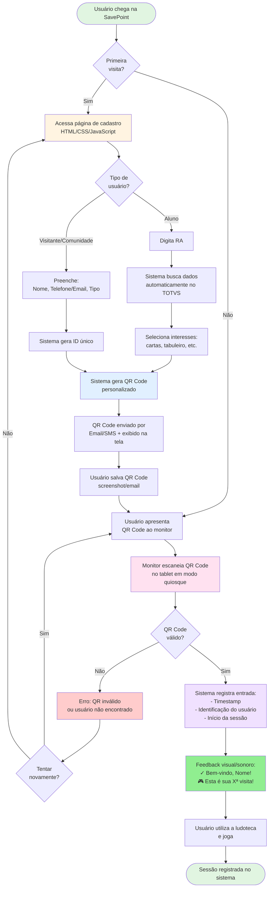

# SavePoint - Sistema de Cadastro para Ludoteca Universitária

## 📋 Contexto do Problema

A SavePoint é uma ludoteca universitária que possibilita a convivência e aprendizado por meio de jogos. Centenas de alunos e visitantes passam por lá toda semana.

### Desafio Principal
Captar e integrar cadastros de visitantes da SavePoint de forma rápida, intuitiva e confiável - inclusive crianças e grupos - gerando relatórios de análises.

---

## 🔄 Processo Atual (Forms em Tablets)

1. **Chegada**: Boas-vindas e direcionamento ao tablet
2. **Seleção de Perfil**: Usuário seleciona "Aluno/Comunidade/Visitante"
3. **Coleta de Dados**:
   - **Aluno**: RA, interno/externo, interesses (cartas, tabuleiro, quebra-cabeça, videogame, xadrez)
4. **Envio**: Resposta enviada

### Responsáveis
- Monitores da ludoteca oferecem o tablet para quem chega

---

## 📊 Estrutura de Dados

### Dados Coletados no Forms
- RA (para alunos)
- Tipo: Aluno/Comunidade/Visitante
- Status: Interno/Externo
- Interesses: cartas, tabuleiro, quebra-cabeça, videogame, xadrez

### Base TOTVS (Alunos)
- RA (código único)
- Nome
- Sexo
- Data de nascimento
- Idade
- Telefone
- Email
- Número da Casa
- Bairro
- Cidade
- CEP
- Data de Matrícula
- Polo
- Curso
- Religião
- Período Letivo
- Status
- tipo_matricula

### Cruzamento Atual
Manual entre planilha de cadastros e extração do TOTVS

---

## 📈 Análises Necessárias

- **Frequência**: por mês, por semana, por dia, por dia da semana, por período
- **Visitantes únicos** em determinado período
- **Perfil demográfico**:
  - Sexo
  - Interno/Externo
  - Cursos
  - Religião
  - Idade

---

## ✅ Requisitos Funcionais

### UX/UI
- [ ] Tela final estimular "enviar outra resposta"
- [ ] Retorno automático à tela inicial após timeout
- [ ] Feedback evidente (mensagem/vibração)
- [ ] Modo quiosque (full-screen, impedir sair do app)
- [ ] Interface acessível

### Funcionalidades Especiais
- [ ] Cadastro de crianças (com responsável?)
- [ ] Cadastro de grupos (famílias/turmas) de uma vez
- [ ] Validação robusta dos campos

### Performance
- [ ] Tempo de cadastro rápido
- [ ] Processo ágil para visitantes recorrentes

### Integração
- [ ] Integração automática com extração de dados do TOTVS
- [ ] Cruzamento automático de dados

---

## 💡 Solução Proposta: Sistema de ID/QR Code

### Conceito
Sistema de carteirinha digital onde o usuário se cadastra uma vez e recebe um ID com QR Code para entradas futuras.

### Três Níveis de Acesso
1. **Usuário**: Cadastro e visualização do próprio QR Code
2. **Monitor**: Escaneamento de QR Codes e registro de entradas
3. **Admin**: Análises, relatórios e gerenciamento

### Preocupação Principal
**ATRITO** - Necessidade de balancear:
- Rapidez no cadastro inicial
- Facilidade de uso recorrente
- Qualidade dos dados coletados
- Cruzamento automático com TOTVS

---

## 🔄 Fluxograma do Sistema

### Fluxo Completo: Do Cadastro à Sessão de Jogo

### Tempos Estimados por Fluxo

| Cenário | Tempo Estimado |
|---------|----------------|
| **Aluno - Primeira Visita** | 20-30 segundos |
| **Visitante - Primeira Visita** | 30-40 segundos |
| **Visitas Seguintes (com QR Code)** | 2-3 segundos |
| **Grupo/Turma (20 alunos)** | 10-15 segundos |

### Descrição das Etapas

1. **🆕 Cadastro Inicial**
   - Usuário preenche dados mínimos na página web
   - Sistema valida e busca informações complementares (TOTVS para alunos)
   - Gera QR Code único e personalizado

2. **📱 Recebimento da Carteirinha Digital**
   - QR Code enviado por email/SMS
   - Usuário pode salvar no celular ou imprimir
   - Válido para todas as visitas futuras

3. **✅ Check-in Rápido**
   - Monitor escaneia QR Code no tablet
   - Sistema identifica usuário instantaneamente
   - Registra entrada com timestamp automático

4. **🎮 Sessão de Jogo**
   - Entrada registrada no banco de dados
   - Disponível para relatórios e análises
   - Histórico do usuário atualizado

---

## 🎯 Problemas a Resolver

### 1. Atrito no Primeiro Cadastro
**Desafio**: Como tornar o cadastro inicial rápido sem perder qualidade dos dados?

**Ideias**:
- **Cadastro em 2 etapas**: 
  - Etapa mínima (RA para alunos) → gera QR code imediatamente
  - Complemento de dados depois (em casa, via app/web)
- **Auto-preenchimento via RA**: 
  - Aluno digita apenas RA
  - Sistema puxa dados do TOTVS automaticamente
  - Usuário só confirma e adiciona interesses
- **Cadastro prévio online**:
  - Enviar link antes de visitar
  - Chegar com QR code já pronto
- **Escalonamento de dados**:
  - 1ª visita: dados mínimos
  - Visitas seguintes: sistema pede dados complementares gradualmente

### 2. Visitantes Não-Alunos (Comunidade/Visitantes)
**Desafio**: Como cadastrar rapidamente quem não tem RA?

**Ideias**:
- **Geração de ID próprio**: Sistema cria ID único ao cadastrar
- **Cadastro por CPF/Telefone**: Validação e ID único
- **Opção "visitante rápido"**:
  - Dados mínimos (nome, tipo)
  - QR code temporário válido por X dias
  - Incentivo para completar cadastro depois
- **Login social**: Google/Facebook para acelerar (dados já preenchidos)

### 3. Cadastro de Crianças
**Desafio**: Crianças podem não ter documentos/RA próprios

**Ideias**:
- **Vinculação ao responsável**:
  - Responsável se cadastra
  - Adiciona dependentes ao perfil
  - Gera QR codes individuais vinculados
- **Cadastro simplificado para crianças**:
  - Nome, idade, responsável
  - Sem email/telefone próprios
- **QR code familiar**:
  - Um código registra entrada de todos
  - Sistema mostra lista para confirmar quem veio

### 4. Cadastro de Grupos
**Desafio**: Turmas/famílias chegando juntas - evitar cadastrar um por um

**Ideias**:
- **Modo "Grupo"** no app do monitor:
  - Escaneia múltiplos QR codes em sequência rápida
  - Confirmação em lote
- **QR code de grupo**:
  - Professor/líder tem código especial
  - Ao escanear, sistema lista membros do grupo
  - Monitor marca quem está presente (checkboxes)
- **Check-in antecipado**:
  - Responsável/professor agenda visita
  - Informa lista de participantes
  - No dia: escaneia QR do grupo → todos registrados

### 5. Primeiros Visitantes Sem QR Code
**Desafio**: Pessoa nunca veio antes, não tem QR code

**Ideias**:
- **Cadastro expresso no tablet do monitor**:
  - Monitor seleciona "novo visitante"
  - Formulário ultra-simplificado
  - Envia QR code por email/SMS imediatamente
  - Ou mostra QR na tela para screenshot
- **Modo híbrido**:
  - Primeira vez: preenchimento assistido pelo monitor (rápido)
  - Sistema já gera QR code
  - Próximas: só escaneia
- **Estação de auto-cadastro**:
  - Tablet separado para novos usuários
  - Monitor só escaneia QR codes (fila rápida)
  - Novatos usam outro tablet para se cadastrar

### 6. Integração TOTVS
**Desafio**: Automatizar cruzamento de dados sem processo manual

**Ideias**:
- **API de integração**:
  - Sistema consulta TOTVS em tempo real ao digitar RA
  - Atualização periódica (sync noturno) de base local
- **Importação programada**:
  - Cron job diário puxa dados atualizados do TOTVS
  - Mantém base local sincronizada
- **Webhook/trigger**:
  - TOTVS notifica sistema quando há novos alunos
  - Atualização incremental

### 7. Feedback e Confirmação
**Desafio**: Usuário precisa saber que registrou com sucesso

**Ideias**:
- **Feedback multi-sensorial**:
  - Visual: tela verde com ✓, animação
  - Sonoro: "beep" de confirmação
  - Tátil: vibração do tablet
- **Mensagem personalizada**:
  - "Bem-vindo de volta, [Nome]!"
  - "Esta é sua [X]ª visita!"
  - Gamificação leve
- **Comprovante digital**:
  - Opção de receber email/SMS confirmando entrada
  - Útil para controle de horas complementares

### 8. Modo Quiosque e Segurança
**Desafio**: Impedir que usuários saiam do app ou acessem outras funções

**Ideias**:
- **Kiosk mode nativo**:
  - Android: App em modo kiosk (single-app mode)
  - iPad: Guided Access
- **Autenticação por NFC/RFID** (alternativa):
  - Carteirinhas físicas com chip
  - Mais rápido que QR code
  - Backup se tablet travar
- **Timeout agressivo**:
  - 5-10 segundos sem ação → volta ao início
  - Previne cadastros abandonados

---

## 🏗️ Arquitetura Sugerida

### Frontend
- **App Monitor** (Tablet - modo quiosque)
  - Escaneamento de QR codes
  - Cadastro rápido de novos usuários
  - Offline-first (funciona sem internet)
- **Portal Usuário** (Web/Mobile)
  - Cadastro completo
  - Visualização do QR code pessoal
  - Histórico de visitas
- **Dashboard Admin** (Web)
  - Relatórios e análises
  - Gerenciamento de usuários
  - Exportação de dados

### Backend
- API REST
- Banco de dados relacional
- Job de sincronização com TOTVS
- Sistema de filas para processos assíncronos

### Integrações
- TOTVS (consulta de dados de alunos)
- Email/SMS (envio de QR codes)
- Gerador de QR codes
- Analytics

---

## 🎮 Fluxos Principais

### Fluxo 1: Aluno - Primeira Visita
1. Monitor oferece tablet
2. Usuário digita apenas RA
3. Sistema puxa dados do TOTVS automaticamente
4. Usuário seleciona interesses (checkboxes rápidos)
5. Sistema gera QR code
6. QR code enviado por email/SMS + mostrado na tela
7. Entrada registrada automaticamente
8. **Tempo estimado: 20-30 segundos**

### Fluxo 2: Aluno - Visitas Seguintes
1. Monitor escaneia QR code do celular do aluno
2. Sistema registra entrada
3. Feedback visual/sonoro
4. **Tempo estimado: 2-3 segundos**

### Fluxo 3: Visitante Comunidade - Primeira Visita
1. Monitor oferece tablet
2. Usuário preenche: Nome, Telefone/Email, Tipo (comunidade/visitante)
3. Sistema gera QR code e ID único
4. QR code enviado + mostrado na tela
5. Entrada registrada
6. **Tempo estimado: 30-40 segundos**

### Fluxo 4: Grupo/Turma
1. Professor agenda visita previamente (web)
2. Informa lista de RAs dos alunos
3. Sistema gera QR code de grupo
4. No dia da visita: monitor escaneia QR do grupo
5. Sistema mostra lista de alunos esperados
6. Monitor confirma presentes
7. **Tempo estimado: 10-15 segundos para grupo de 20 alunos**

---

## 📱 Stack Tecnológica Sugerida

### Opção 1: Web App (PWA)
- **Frontend**: React/Next.js + TailwindCSS
- **QR Scanner**: html5-qrcode library
- **Backend**: Node.js + Express ou Python + FastAPI
- **Database**: PostgreSQL
- **Vantagens**: Funciona em qualquer tablet, fácil atualização

### Opção 2: App Nativo
- **Frontend**: React Native ou Flutter
- **Vantagens**: Melhor controle de modo quiosque, acesso a recursos nativos

### Opção 3: Híbrido
- Web app para admin e usuários
- App nativo para tablets dos monitores

---

## 🚀 MVP - Escopo Mínimo

### Funcionalidades Essenciais
1. Cadastro simplificado (RA para alunos)
2. Integração com TOTVS (mesmo que manual inicialmente)
3. Geração de QR codes
4. App de escaneamento para monitores
5. Registro de entradas com timestamp
6. Dashboard básico com métricas principais

### Pode Ficar para v2
- Cadastro de grupos
- Gamificação
- Agendamento de visitas
- App mobile para usuários
- Relatórios avançados
- Integração automática TOTVS

---

## 📊 Métricas de Sucesso

- **Tempo médio de cadastro**: < 30 segundos (primeira visita)
- **Tempo médio de check-in**: < 5 segundos (visitas recorrentes)
- **Taxa de retorno**: % de visitantes que voltam
- **Completude de dados**: % de perfis com dados completos
- **Satisfação**: NPS dos monitores e usuários

---

## ⚠️ Riscos e Mitigações

| Risco | Impacto | Mitigação |
|-------|---------|-----------|
| Resistência dos usuários ao QR code | Alto | Campanha de comunicação, benefícios claros |
| Falha de internet no tablet | Médio | Modo offline, sincronização posterior |
| Bateria do celular do usuário acabada | Médio | Cadastro rápido via RA como fallback |
| TOTVS sem API disponível | Alto | Importação manual automatizada (RPA) |
| Tablets roubados/danificados | Médio | Backup em nuvem, autenticação dos dispositivos |

---

## 📝 Próximos Passos

1. [ ] Validar solução com stakeholders (administração, monitores, alunos)
2. [ ] Definir stack tecnológica
3. [ ] Prototipar interface (Figma)
4. [ ] Testar integração TOTVS (viabilidade técnica)
5. [ ] Desenvolver MVP
6. [ ] Teste piloto com grupo pequeno
7. [ ] Iteração baseada em feedback
8. [ ] Lançamento oficial

---

## 💭 Ideias Complementares

### Gamificação
- Badges por quantidade de visitas
- Ranking de frequentadores
- Desafios mensais

### Funcionalidades Sociais
- Check-in compartilhável nas redes sociais
- Indicação de amigos (ganha benefício)

### Inteligência
- Recomendação de jogos baseada em interesses
- Previsão de horários de pico
- Alertas de lotação

### Acessibilidade
- Modo alto contraste
- Suporte a leitores de tela
- Opção de texto grande
- Múltiplos idiomas (português, inglês, libras via vídeo)

---

*Documento criado em: 26/10/2025*
*Versão: 1.0*